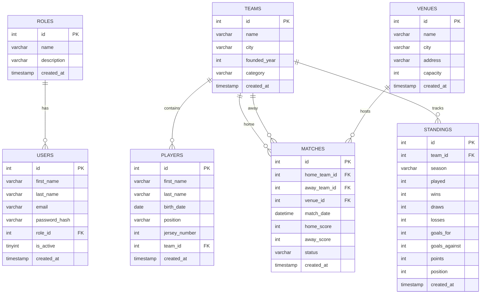

# Entity Relationship Diagram

```mermaid
erDiagram
    ROLES ||--o{ USERS : has
    TEAMS ||--o{ PLAYERS : contains
    TEAMS ||--o{ MATCHES : home
    TEAMS ||--o{ MATCHES : away
    VENUES ||--o{ MATCHES : hosts
    TEAMS ||--o{ STANDINGS : tracks

    ROLES {
        int id PK
        varchar name
        varchar description
        timestamp created_at
    }

    USERS {
        int id PK
        varchar first_name
        varchar last_name
        varchar email
        varchar password_hash
        int role_id FK
        tinyint is_active
        timestamp created_at
    }

    TEAMS {
        int id PK
        varchar name
        varchar city
        int founded_year
        varchar category
        timestamp created_at
    }

    PLAYERS {
        int id PK
        varchar first_name
        varchar last_name
        date birth_date
        varchar position
        int jersey_number
        int team_id FK
        timestamp created_at
    }

    VENUES {
        int id PK
        varchar name
        varchar city
        varchar address
        int capacity
        timestamp created_at
    }

    MATCHES {
        int id PK
        int home_team_id FK
        int away_team_id FK
        int venue_id FK
        datetime match_date
        int home_score
        int away_score
        varchar status
        timestamp created_at
    }

    STANDINGS {
        int id PK
        int team_id FK
        varchar season
        int played
        int wins
        int draws
        int losses
        int goals_for
        int goals_against
        int points
        int position
        timestamp created_at
    }
```

This ERD covers the main entities required for the handball league management application in Milestone 1.
